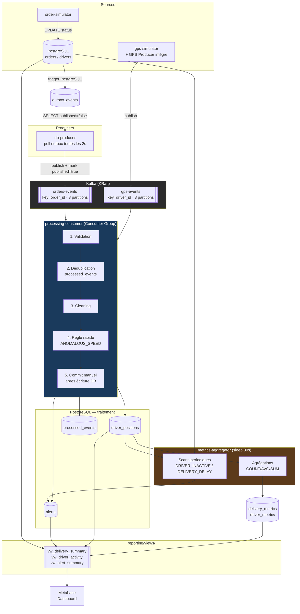

# Architecture — Real-Time Delivery & Fleet Monitoring Platform

Schéma du pipeline complet : sources → Kafka → traitement temps réel →
PostgreSQL → agrégation périodique → reporting.

```mermaid
flowchart TB
    subgraph Sources
        PG_SRC[(PostgreSQL<br/>orders / drivers)]
        ORD_SIM[order-simulator]
        GPS_SIM[gps-simulator<br/>+ GPS Producer intégré]
    end

    ORD_SIM -->|UPDATE status| PG_SRC
    PG_SRC -->|trigger PostgreSQL| OUTBOX[(outbox_events)]

    subgraph Producers
        DB_PROD[db-producer<br/>poll outbox toutes les 2s]
    end

    OUTBOX -->|SELECT published=false| DB_PROD

    subgraph Kafka["Kafka (KRaft)"]
        T1[["orders-events<br/>key=order_id · 3 partitions"]]
        T2[["gps-events<br/>key=driver_id · 3 partitions"]]
    end

    DB_PROD -->|publish + mark published=true| T1
    GPS_SIM -->|publish| T2

    subgraph Processing["processing-consumer (Consumer Group)"]
        direction TB
        VALID[1. Validation]
        DEDUP[2. Déduplication<br/>processed_events]
        CLEAN[3. Cleaning]
        RULE[4. Règle rapide<br/>ANOMALOUS_SPEED]
        COMMIT[5. Commit manuel<br/>après écriture DB]
        VALID --> DEDUP --> CLEAN --> RULE --> COMMIT
    end

    T1 --> Processing
    T2 --> Processing

    subgraph DB["PostgreSQL — traitement"]
        DP[(driver_positions)]
        AL[(alerts)]
        PE[(processed_events)]
    end

    Processing --> DP
    Processing --> AL
    Processing --> PE

    subgraph Analytics["metrics-aggregator (sleep 30s)"]
        direction TB
        AGG[Agrégations<br/>COUNT/AVG/SUM]
        SCAN[Scans périodiques<br/>DRIVER_INACTIVE / DELIVERY_DELAY]
    end

    DP --> AGG
    PG_SRC --> SCAN
    DP --> SCAN
    AGG --> DM[(delivery_metrics<br/>driver_metrics)]
    SCAN --> AL

    subgraph Reporting["reporting/views/"]
        VIEWS[["vw_delivery_summary<br/>vw_driver_activity<br/>vw_alert_summary"]]
    end

    PG_SRC --> VIEWS
    AL --> VIEWS
    DP --> VIEWS
    DM --> VIEWS

    VIEWS --> META[Metabase<br/>Dashboard]

    style Kafka fill:#2b2b2b,color:#fff
    style Processing fill:#1a3a5c,color:#fff
    style Analytics fill:#5c3a1a,color:#fff
```